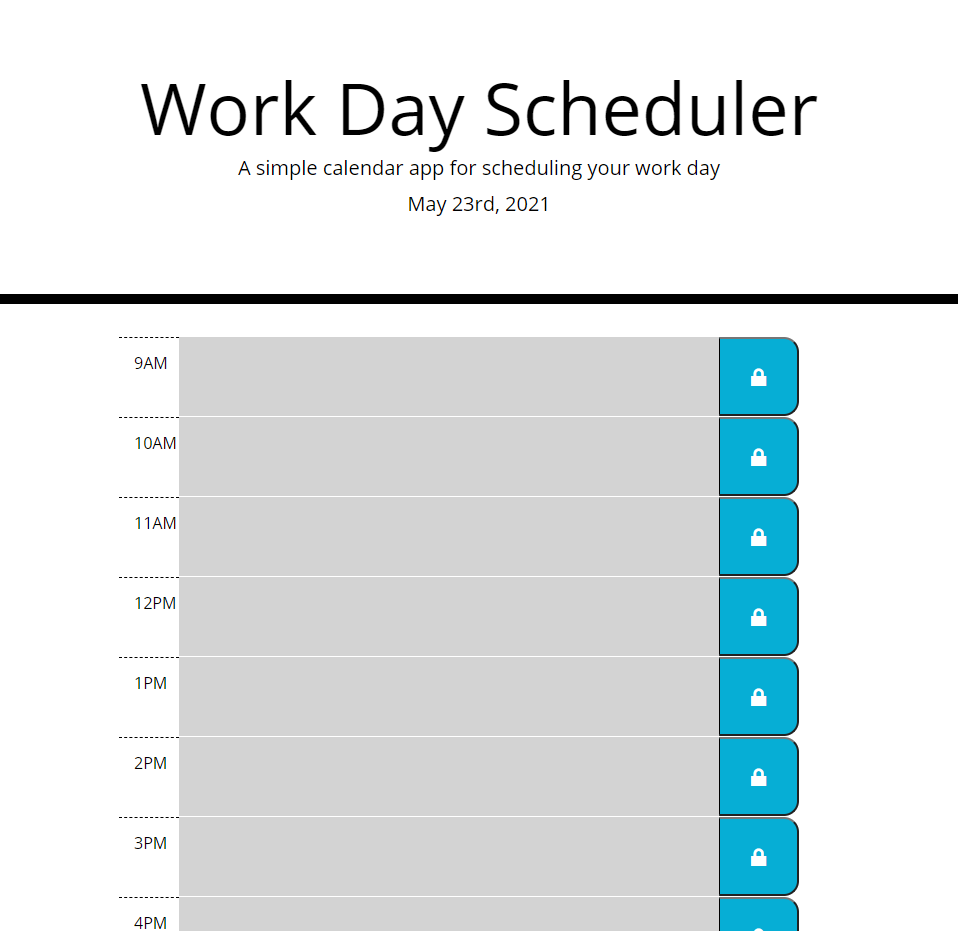

# Work Day Scheduler
U of T Full Stack Web Dev Bootcamp Challenge 5

## Description
A page where you can write down what you need to do during a day at each hour. The page colours each hour to indicate if that hour is in the past, present or future, and the page saves what you type into local storage, so that you can refresh the page, close it and come back, etc. Uses jQuery and Moment.js third-party APIs.

[Link to the live page](https://rookieprime.github.io/workday-scheduler/)

[Link to repository](https://github.com/RookiePrime/workday-scheduler)